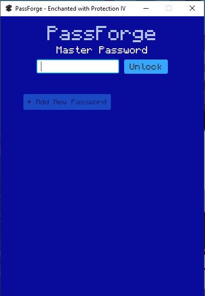
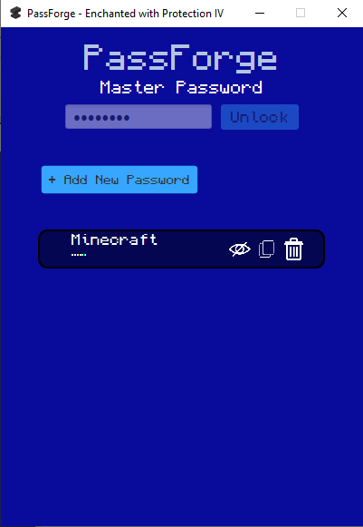
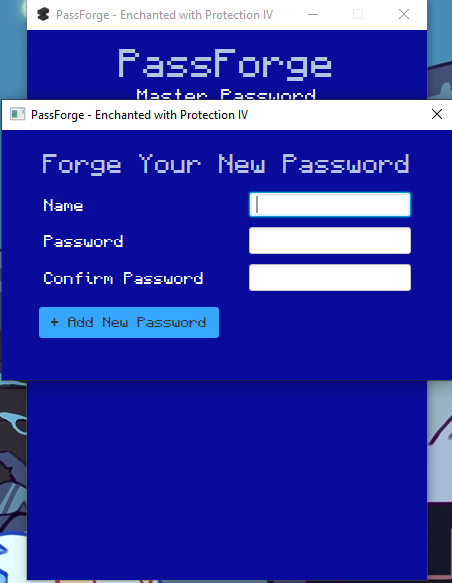

# 🔐 PassForge

**PassForge** is a secure and modern JavaFX-based password manager built using Java 17, SQLite, and FormsFX. It features a smooth, intuitive UI and modular structure, allowing for easy maintenance and extension; as well as utilizing PBKDF2WithHmacSHA256 with random salt to store the master password and AES Secret Key with PBKDF2 for encrypting each added password.

---
## 🖥 Features

- 🗝 Secure password storage with local SQLite DB
- 📋 Beautiful FormsFX-based UI with validation
- 📦 Native Windows installer using `jpackage`

---

## 📷 Screenshots

<!-- Replace with actual paths to your screenshots -->




---

## ⚙️ Setup & Development
- To get started quickly without the extra steps go to the link below -> download the installer.
- Follow the installation wizard and a windows shortcut of PassForge will be made on your desktop.
- Next... No other steps, its as easy as that.
  
## 📦 Downloads

| Version | Platform | Type | Download |
|---------|----------|------|----------|
| 1.0.0   | Windows  | Installer (.exe) | [Download](https://github.com/HobbyistProgrammer/PassForge/blob/main/installer/PassForgeInstaller.exe) |

---

## 🧪 Version History

| Version | Date       | Notes                    |
|---------|------------|--------------------------|
| 1.0.0   | 2025-06-11 | Initial release          |

---

```bash
git clone https://github.com/HobbyistProgrammer/PassForge.git
cd PassForge
./gradlew run
```

## 🛠 Built With

- Java 17 or JDK 22
- JavaFX 17.0.6
- Gradle 8.8
- SQLite JDBC 3.49.0.0
- ControlsFX 11.2.1
- FormsFX 11.6.0

---

## 🔒 Security Overview

PassForge ensures user data privacy through the following cryptographic practices:

- **Master Password Authentication**
  - Uses `PBKDF2WithHmacSHA256` with a unique salt per user
  - Key derivation performed with 65,536 iterations for resistance to brute-force attacks
  - This makes the master password a one-way to not be able to get the original password back.

- **Password Encryption**
  - Password entries are encrypted using `AES/CBC/PKCS5Padding`
  - The encryption key is derived from the salted master password hash
  - A random IV is generated for each encryption to enhance security

Sensitive data is never stored in plaintext. All keys and IVs are securely handled in memory and cleared where possible after use.

## 🧠 Learnings & Future Plans

### What I Learned
- Implementing modern JavaFX UI with validation
- Secure password storage with real-world crypto practices
- Packaging Java applications with `jpackage`

### Future Plans
- Add password generation tool
- Implement cloud sync (optional encryption layer)
- Add an extra layer of protection for created passwords (Adding an enchantment of protection :) )
- Multi-user support with profiles

---

## 🤝 Questions or Tips
- I am open to feedback and any questions about the application.

---
